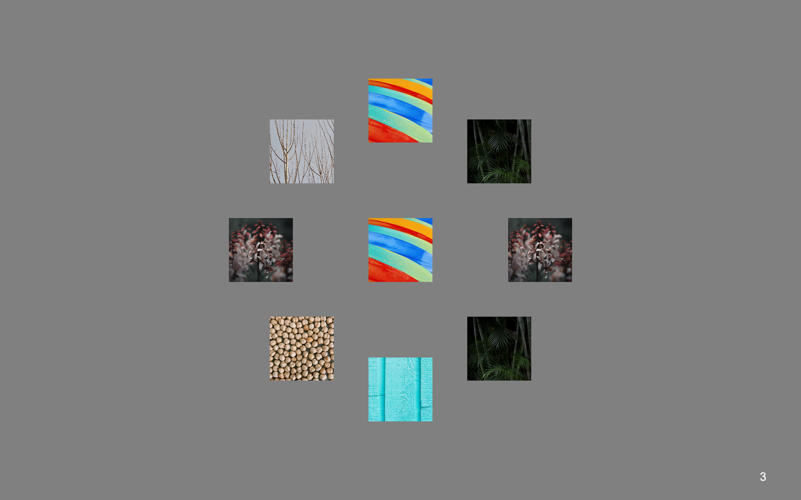
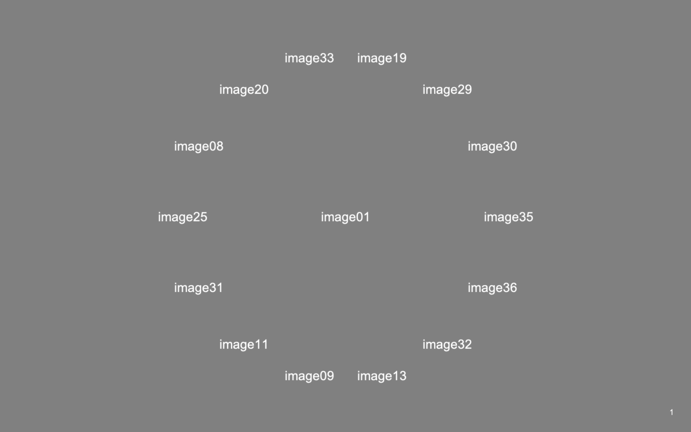

## Similarities

### Downloading dependencies:

#### Python3
The project uses Python 3.8. If you have problems running it with newer versions, try running it with Python 3.7.
The following tutorial can help with installing Python: https://realpython.com/installing-python/

#### PsychoPy3
Install PsychoPy here: https://www.psychopy.org/download.html. 
This project uses PsychoPy v2021.2. 

## Installation and Set-up

```
git clone https://github.com/jvlab/similarities.git
```
Install required packages in a virtual environment

Create virtual env and download dependencies
```
cd ~/similarities
conda env create -f environment.yaml
```
venv_sim_3.8 should be listed when you run
```
conda env list 
```
To enter the virtual environment, before running code
```commandline
conda activate venv_sim_3.8
```
To exit the virtual environment after running scripts
```
conda deactivate
```

Run scripts from the `similarities` directory as modules, e.g.,
```
cd ~/similarities
conda activate venv_sim_3.8
python -m analysis.script_name
...
conda deactivate
```

## Development setup
 TODO (incomplete!)
Describe how to install all development dependencies and how to run an automated test-suite of some kind. Potentially do this for multiple platforms.

```sh
nosetests test
```

## Usage
### Trials in an Experiment
In a typical experiment, there are a series of ranking trials. The analysis requires an  experiment to be repeated multiple times. Our standard procedure assumes 5 repeats. This way each trial ends up being performed 5 times.
A sample trial comprises a stimulus in the center, known as the 'reference', and 8 surrounding stimuli. The number of surrounding stimuli can vary and is controlled by the `num_stimuli_per_trial` parameter.
In each trial, the goal of the subject is to rank stimuli around the reference in order of similarity to the reference. In other words, they must click the most similar item first, then the second-most similar and so on until they have clicked all the surrounding stimuli.
Given a list of stimuli, we can generate randomized configurations of trials, in which each stimulus appears as the central reference and is compared to every other stimulus at least once.
For details on valid designs and the constraints that have to be met, see the preprint [link to be provided] (Section: Discussion).

#### Sample Trials
A trial from the image experiment with `num_stimuli_per_trial=8.` The default value is 8.
 

A sample trial from the word experiment with `num_stimuli_per_trial=14`
 


#### Create Trials
Here, we explain how to use trial_configurations to get trials.
The script `trial_configuration.py` takes in the following parameters from
`experiments/config.yaml`:

1. `num_stimuli`: Size of the stimulus set (default=37)
2. `num_stimuli_per_trial`: Number of stimuli appearing around a reference in each trial (default=8, see above)
3. `path_to_stimulus_list`: Path to the text file containing names of all stimuli, one per line.

Open `experiments/config.yaml` and set the values of these parameters to the desired values.

Then, run the script from the analysis subdirectory in similarities:
```
$ cd ~/similarities
$ python3 -m analysis.trial_configuration

$ ls *.csv
trial_conditions.csv
```
The `trial_conditions.csv` generated contains the subsets of stimuli that will appear in each trial. Each trial's information is in a separate row.
Positions along the circle along which surrounding stimuli appear are given by columns `stim1` to `stim8` (if `num_stimuli_per_trial=8), while the `ref` column indicates which stimulus appears in the center.
The `stim1` position is always to the right of the reference. `stim2` onwards run clockwise from `stim1.`

##### Randomize Trials
Next, we need to duplicate the conditions files for each repetition of the experiment. In the standard procedure, we break up the 222 trials generated into two sessions of 111 trials each. 
Thus, each repetition comprises two sessions. 

For each time an experiment is to be conducted/repeated do the following to randomize the trial order and stimulus position within trials:

*Add a row and column to randomize columns and rows by*
1. Open `trial_conditions.csv` in Microsoft Excel.
2. Insert a new row under the header row (Row 1), run the random command (=RAND()) to populate cells in all columns except the `ref` column.
3. Insert a new column after the last column, on the right side, and run the random command (=RAND()) to populate all cells in the column from rows 3 onward.

*Randomize stimulus position across trials (shuffling columns within rows)*
1. Run the =RAND() function in all the cells of Row 2 to generate new random numbers.
2. Excluding columns `ref` and the last random number column, select all rows from Row 2 onward.
3. In Excel, click **Home**, then **Sort & Filter**, then select **Custom Sort**.
4. Click **Options** button in the bottom right corner of the pop-up, then under Orientation, select **Sort left to right.**
5. In the table that pops up, under **Row**, make sure "Row 2" is selected and click **OK**.
6. If column values under `stim1` to `stim8` do not shuffle, perform the sorting again by clicking **Sort & Filter** in the toolbar, then selecting **Custom Sort** and clicking **OK**.

*Randomize trial order (shuffling rows)*
1. Run the =RAND() function in all the cells of the last column to generate new random numbers.
2. Select all rows starting from Row 3 onwards - include all columns.
3. As before, in the toolbar, click **Sort & Filter**, then **Custom Sort**, then the **Options** button in the bottom right.
4. Under Orientation, select **Sort top to bottom.**
5. In the table that appears, under **Column**, make sure the last column (in our case, Column J) is selected.
6. Click **OK**.
7. As before, if rows do not shuffle, perform sorting again by clicking **Sort & Filter** in the toolbar, then selecting **Custom Sort** and clicking **OK**.

*Save in two new files*
1. Create two new files.
2. Copy the header row (Row 1) into both files.
3. In the first file, copy and paste Rows 3-113, i.e., half of the trials.
4. In the second file, copy and paste Rows 114-224.
5. Save each file as `conditions.csv` in the appropriate directory (see Recommended Directory Structure below).

NOTE: The above breakdown of trials into conditions files may be different if performing this operation for a non-standard version of the experiment. With 37 stimuli, and 8 stimuli around the reference in each trial, we have 222 trials. Each session comprises 111 trials. 

### Recommended Directory Structure
#### subject-data
The subject-data directory should have two subdirectories for raw and preprocessed data and be organized as follows:
```
subject-data/
    raw/
        Subject1/
            repeat_1/
                DD-MM-YYYY/
                    conditions.csv
                    responses.csv
                    DD-MM_YYYY.log
                DD-MM-YYYY/
                    conditions.csv
                    responses.csv
                    DD-MM_YYYY.log
            repeat_2
            repeat_3
            repeat_4
            repeat_5
        Subject2/
    ...

    preprocessed/
        Subject1_exp.json
        Subject2_exp.json
        ...
```


### Scripts and Their Input Parameters
#### trial_configuration.py
This as explained above creates a conditions file, containing the configurations of experimental trials.
There are no user inputs that need to be entered into the command line.
```
cd ~/similarities
python3 -m analysis.trial_configuration
```

#### preprocess.py
This converts the raw csv files containing similarity judgments from a subject's complete dataset, and combines them into a single json file.
To run, navigate to the main directory. (All scripts should be run from this directory).

```
cd ~/similarities
python3 -m analysis.preprocess
```

*Input parameters:*
1. Path to subject-data directory *(string)*
2. Name of experiment *(string)*: this is used to name the output file
3. Subject IDs *(strings separated by spaces if more than one)*

#### describe_data.py
This generates some figures describing the choice probabilities obtained experimentally after they have been preprocessed.

```
cd ~/similarities
python3 -m analysis.describe_data
```

*Input parameters:*
1. Subject IDs *(strings separated by spaces if more than one)*
2. Path to subject-data/preprocessed directory *(string)*

#### model_fitting.py
This script takes in similarity judgments (reads in a json file) and finds the configuration of points in 1, 2, 3, 4 and 5 dimensional space that explain the judgments.
```
cd ~/similarities
python3 -m analysis.model_fitting
```

*Input parameters:*
1. Path to json file containing subject's preprocessed data
2. Experiment name
3. Subject name or ID
4. Number of iterations - how many times this should analysis be run (e.g. 1)
5. Output directory
6. Sigma (a noise parameter - default value = 0.18)

#### perceptual_space_visualization.py

 This script applies PCA on the 5D coordinates return by the modeling. It then shows a scatterplot of the points projected on the first  2 principal components.
```
cd ~/similarities
python3 -m analysis.perceptual_spaces_visualization
```

*Input parameters:*
1. Path to npy file (string)
2. Subject name or ID (string)

### Reproducing Figures
To reproduce figures from our accompanying manuscript, do the following:
Run `describe_data` from the `similarities` directory

Note that since only one subject's dataset is provided, the comparison heatmap (Figure 4) will not be made.
```
$ cd ~/similarities
$ python3 -m analysis.describe_data
```

This will result in the following output, in response to which you should enter "S7", the identifier of the dataset provided
```
Subjects separated by spaces:S7
```
The script will ask for a path to the preprocessed data directory. Enter it as follows:
```
Path to the subject-data/preprocessed directory
 e.g., './sample-materials/subject-data/preprocessed': ./sample-materials/subject-data/preprocessed
```
This will produce two charts (one after the other) that show data from Figures 3A and 4.

To produce Figure 6, run `perceptual_space_visualization` and enter the path to the npy file containing model-fitting results:
```
$ cd ~/similarities
$ python3 -m analysis.perceptual_space_visualizations
```
Enter the input parameters requested as follows, and press enter to create the figure.
```
Path to npy file containing 5D coordinates (e.g., ./sample-materials/subject-data/model-fitting/S7/S7_word_anchored_points_sigma_0.18_dim_5.npy): ./sample-materials/subject-data/model-fitting/S7/S7_word_anchored_points_sigma_0.18_dim_5.npy
Subject name or ID (e.g., S7): S7
```

## Release History
* 0.1.0
    * The first proper release
    * CHANGE: Added scripts in analysis
* 0.0.1
    * Work in progress

## Metadata

Suniyya A. Waraich – saw4003@med.cornell.edu

Distributed under the MIT license. See ``LICENSE`` for more information.

[https://github.com/suniyya/github-link](https://github.com/suniyya)

## Contributing

1. Fork it (<https://github.com/yourname/yourproject/fork>)
2. Create your feature branch (`git checkout -b feature/fooBar`)
3. Commit your changes (`git commit -am 'Add some fooBar'`)
4. Push to the branch (`git push origin feature/fooBar`)
5. Create a new Pull Request

